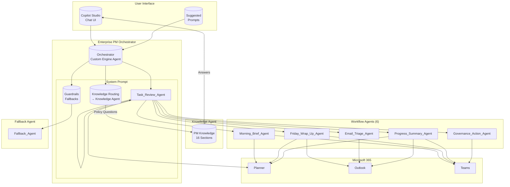
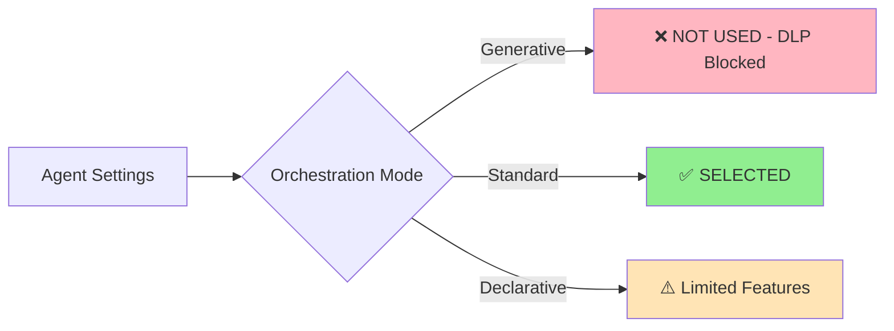
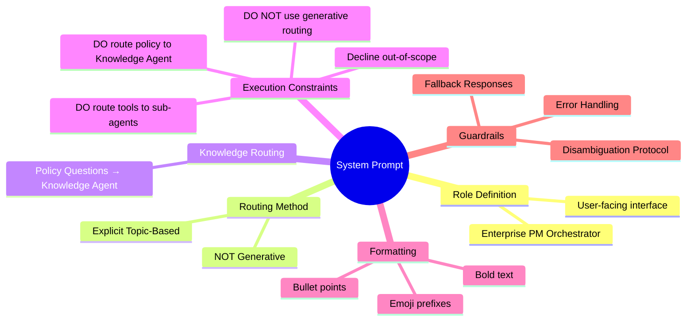
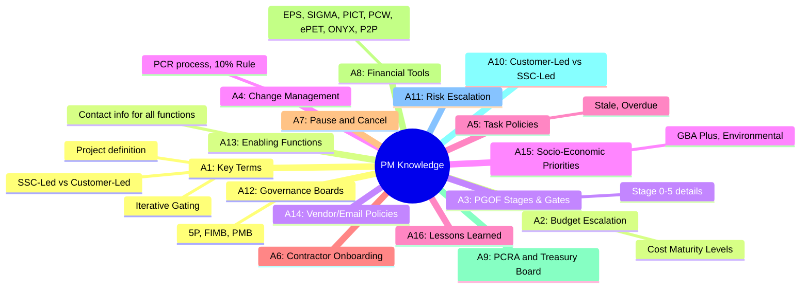
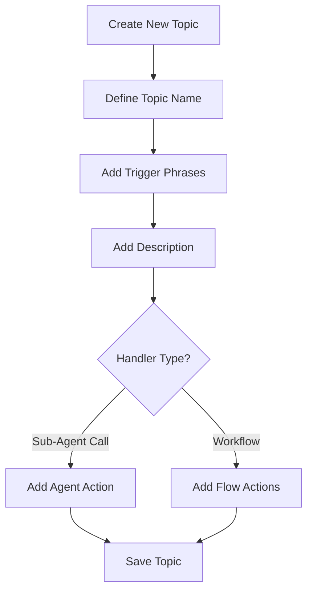
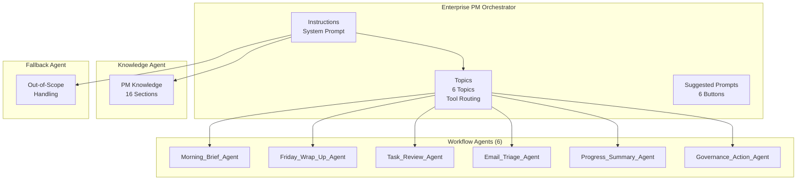

# Implementation Guide: Building the DLP-Compliant PM Agent

This guide provides step-by-step instructions for building the Enterprise PM Orchestrator in Copilot Studio with DLP-compliant Topic-based routing.

---

## Architecture Overview

### New 9-Agent Architecture

The PM Agent system now uses **9 agents** for cleaner separation of concerns:

| Agent | Type | Purpose |
|-------|------|---------|
| **Orchestrator** | Main | User-facing interface, routes to sub-agents |
| **Knowledge Agent** | Sub-agent | PM Operating Guide knowledge base |
| **Morning_Brief_Agent** | Sub-agent | Daily brief workflow |
| **Friday_Wrap_Up_Agent** | Sub-agent | Weekly wrap-up workflow |
| **Task_Review_Agent** | Sub-agent | Task management |
| **Email_Triage_Agent** | Sub-agent | Email scanning |
| **Progress_Summary_Agent** | Sub-agent | Progress reporting |
| **Governance_Action_Agent** | Sub-agent | Teams posting |
| **Fallback Agent** | Sub-agent | Out-of-scope handling |

### System Architecture Diagram



---

## Step 1: Create the Orchestrator Agent

### 1.1 Initialize Agent in Copilot Studio

1. Navigate to [Copilot Studio](https://copilotstudio.microsoft.com)
2. Click **Create** → **New Agent**
3. Configure basic settings:

| Setting | Value |
|---------|-------|
| Name | Enterprise PM Orchestrator |
| Description | DLP-compliant PM system with Topic-based routing |
| Language | English |

### 1.2 Set Orchestration Mode



1. Go to **Agent Settings** → **Orchestration**
2. Select **Standard** mode (not Generative)
3. Save settings

---

## Step 2: Configure System Prompt

### 2.1 Navigate to Instructions

1. In the Orchestrator agent, go to **Instructions**
2. Paste the content from `orchestrator/Orchestrator System Prompt Instructions.md`

### 2.2 Key Sections to Include



---

## Step 3: Create the Knowledge Agent

### 3.1 Create Knowledge Agent

1. In Copilot Studio, create a new agent
2. Configure:

| Setting | Value |
|---------|-------|
| Name | PM Knowledge Agent |
| Description | PM Operating Guide knowledge base |

3. Add **System Prompt** from `orchestrator/Knowledge Agent - PM Operating Guide.md`

### 3.2 Knowledge Content (16 Sections)

The Knowledge Agent contains all PM Operating Guide content:



---

## Step 4: Create Workflow Agents (6)

### 4.1 Morning_Brief_Agent

| Setting | Value |
|---------|-------|
| Name | Morning Brief Agent |
| Description | Daily briefing workflow - tasks + blockers |
| Connectors | Microsoft Planner, Microsoft Teams |

**System Prompt:** `subagents/Morning_Brief_Agent - System Prompt Instructions.md`
**Tool Config:** `subagents/Morning_Brief_Agent - Tool Configuration.md`

### 4.2 Friday_Wrap_Up_Agent

| Setting | Value |
|---------|-------|
| Name | Friday Wrap-Up Agent |
| Description | Weekly stakeholder report workflow |
| Connectors | Microsoft Planner, Microsoft Teams, Office 365 Outlook |

**System Prompt:** `subagents/Friday_Wrap_Up_Agent - System Prompt Instructions.md`
**Tool Config:** `subagents/Friday_Wrap_Up_Agent - Tool Configuration.md`

### 4.3 Task_Review_Agent

| Setting | Value |
|---------|-------|
| Name | Task Review Agent |
| Description | Task status and management |
| Connectors | Microsoft Planner |

**System Prompt:** `subagents/Task_Review_Agent - System Prompt Instructions.md`
**Tool Config:** `subagents/Task_Review_Agent - Tool Configuration.md`

### 4.4 Email_Triage_Agent

| Setting | Value |
|---------|-------|
| Name | Email Triage Agent |
| Description | Vendor email scanning and triage |
| Connectors | Office 365 Outlook |

**System Prompt:** `subagents/Email_Triage_Agent - System Prompt Instructions.md`
**Tool Config:** `subagents/Email_Triage_Agent - Tool Configuration.md`

### 4.5 Progress_Summary_Agent

| Setting | Value |
|---------|-------|
| Name | Progress Summary Agent |
| Description | Project progress and health overview |
| Connectors | Microsoft Planner, Microsoft Teams, Office 365 Outlook |

**System Prompt:** `subagents/Progress_Summary_Agent - System Prompt Instructions.md`
**Tool Config:** `subagents/Progress_Summary_Agent - Tool Configuration.md`

### 4.6 Governance_Action_Agent

| Setting | Value |
|---------|-------|
| Name | Governance Action Agent |
| Description | Teams posting for risk alerts |
| Connectors | Microsoft Teams |

**System Prompt:** `subagents/Governance_Action_Agent - System Prompt Instructions.md`
**Tool Config:** `subagents/Governance_Action_Agent - Tool Configuration.md`

---

## Step 5: Create Fallback Agent

### 5.1 Create Fallback Agent

| Setting | Value |
|---------|-------|
| Name | Fallback Agent |
| Description | Out-of-scope query handling |
| Connectors | None (conversation only) |

**System Prompt:** `subagents/Fallback_Agent - System Prompt Instructions.md`
**Tool Config:** `subagents/Fallback_Agent - Tool Configuration.md`

### 5.2 Fallback Responsibilities

- Handle queries outside PM scope
- Provide clear explanations of limitations
- Suggest alternative actions within scope
- Offer guidance on where to get help

---

## Step 6: Configure Topics (Tool Routing)

### 6.1 Topic Creation Workflow



### 6.2 Create 6 Core Workflow Topics

#### Topic 1: Morning_Brief

| Field | Value |
|-------|-------|
| Name | Morning_Brief |
| Description | Daily briefing workflow - tasks + blockers |
| Handler | Call Morning_Brief_Agent |

**Trigger Phrases:**
```
morning brief
run morning brief
☀️ Run Morning Brief
daily check
what's blocked
daily briefing
```

#### Topic 2: Friday_Wrap_Up

| Field | Value |
|-------|-------|
| Name | Friday_Wrap_Up |
| Description | Weekly stakeholder report workflow |
| Handler | Call Friday_Wrap_Up_Agent |

**Trigger Phrases:**
```
friday wrap-up
weekly wrap
📊 Generate Weekly Wrap
send weekly update
stakeholder report
end of week report
```

#### Topic 3: Task_Review

| Field | Value |
|-------|-------|
| Name | Task_Review |
| Description | Task status and overview |
| Handler | Call Task_Review_Agent |

**Trigger Phrases:**
```
check tasks
overdue tasks
what tasks are due
task status
how many tasks
check my tasks
task summary
create task
assign task
mark complete
```

#### Topic 4: Email_Triage

| Field | Value |
|-------|-------|
| Name | Email_Triage |
| Description | Vendor email scanning and triage |
| Handler | Call Email_Triage_Agent |

**Trigger Phrases:**
```
check vendor updates
check emails
vendor emails
any news from vendors
check for updates
email triage
```

#### Topic 5: Progress_Summary

| Field | Value |
|-------|-------|
| Name | Progress_Summary |
| Description | Project progress and health overview |
| Handler | Call Progress_Summary_Agent |

**Trigger Phrases:**
```
progress summary
project status
where are we
how are we doing
project health
status report
```

#### Topic 6: Governance_Action

| Field | Value |
|-------|-------|
| Name | Governance_Action |
| Description | Teams posting for risk alerts |
| Handler | Call Governance_Action_Agent |

**Trigger Phrases:**
```
post risk alert
high risk
risk escalation
post update
notify team
```

---

## Step 7: Configure Knowledge Routing

### 7.1 Policy Question Routing

The Orchestrator routes policy questions to the Knowledge Agent:

| Question Type | Action |
|---------------|--------|
| Budget escalation matrix | Call Knowledge Agent |
| Stale/overdue task policy | Call Knowledge Agent |
| PGOF stages/gates | Call Knowledge Agent |
| PCR/change request | Call Knowledge Agent |
| Contractor onboarding | Call Knowledge Agent |
| Pause/cancel project | Call Knowledge Agent |
| Financial tools | Call Knowledge Agent |
| PCRA/Treasury Board | Call Knowledge Agent |
| Customer-Led vs SSC-Led | Call Knowledge Agent |
| Governance boards | Call Knowledge Agent |
| Vendor triage keywords | Call Knowledge Agent |
| Key terms and definitions | Call Knowledge Agent |
| Change management | Call Knowledge Agent |
| Risk escalation | Call Knowledge Agent |
| Enabling functions contact info | Call Knowledge Agent |
| Socio-economic priorities | Call Knowledge Agent |
| Lessons learned | Call Knowledge Agent |

---

## Step 8: Configure Suggested Prompts

### 8.1 Add Persistent Buttons

| Prompt Text | Action |
|-------------|--------|
| ☀️ Run Morning Brief | Topic: Morning_Brief |
| 📊 Generate Weekly Wrap | Topic: Friday_Wrap_Up |
| 📧 Check Vendor Updates | Topic: Email_Triage |
| 📋 Check My Tasks | Topic: Task_Review |
| 📈 Progress Summary | Topic: Progress_Summary |
| 🚨 Post Risk Alert | Topic: Governance_Action |

---

## Step 9: Configure Safety Settings

### 9.1 Mark Actions as Consequential

| Action | Connector | Setting |
|--------|-----------|---------|
| Update a task | Microsoft Planner | Require user confirmation |
| Send an email | Office 365 Outlook | Require user confirmation |
| Post message | Microsoft Teams | Require user confirmation |

---

## Step 10: Test the Agent

### 10.1 Test Routing

| Test ID | Input | Expected Handler |
|---------|-------|------------------|
| T-01 | "What tasks are overdue?" | Task_Review_Agent |
| T-02 | "Check vendor emails" | Email_Triage_Agent |
| T-03 | "What is the budget policy?" | Knowledge Agent |
| T-04 | "What are Gate 2 requirements?" | Knowledge Agent |
| T-05 | "Run morning brief" | Morning_Brief_Agent |
| T-06 | "Post a risk alert" | Governance_Action_Agent |
| T-07 | "Can you approve this invoice?" | Fallback Agent |

---

## Step 11: Deploy to Teams

### 11.1 Deployment Checklist

- [ ] Orchestrator System Prompt configured
- [ ] Knowledge Agent created with PM Operating Guide
- [ ] All 6 workflow agents created with connectors
- [ ] Fallback Agent created
- [ ] All 6 Topics configured with trigger phrases
- [ ] Consequential actions marked
- [ ] Suggested prompts configured
- [ ] Test cases passing
- [ ] Publish to Microsoft Teams

---

## Architecture Summary



---

## Reference Files

| File | Purpose |
|------|---------|
| `orchestrator/Orchestrator System Prompt Instructions.md` | **Orchestrator routing + guardrails** |
| `orchestrator/Knowledge Agent - PM Operating Guide.md` | **Knowledge Agent content** |
| `orchestrator/Topic Routing Configuration.md` | 6 Core workflow Topics |
| `subagents/* - System Prompt Instructions.md` | Sub-agent prompts (8 files) |
| `subagents/* - Tool Configuration.md` | Connector setup (8 files) |
| `docs/TDD Specification.md` | Test cases |